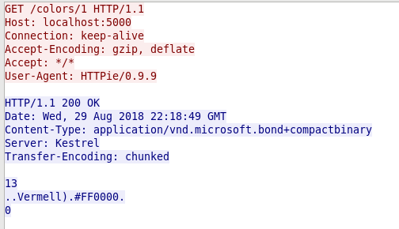

# Fer servir Microsoft Bond

Bond és un framework per treballar amb dades estructurades de codi obert i multiplataforma.
Ofereix serialització i una forma eficient de manipulació de dades. (Diuen que ho fan servir molt internament)

S'assembla a Google ProtocolBuffers.

Fins ara havia vist en algun projecte en el que havia col·laborat l'increment de rendiment que donava fer servir un format binari com 'protocolbuffers' sobre json.

Microsoft té el codi font de **Microsoft Bond** a [GitHub](https://github.com/Microsoft/bond)

- Més informació:
  - [Article de Toptal](https://www.toptal.com/microsoft/meet-bond-microsoft-bond)
  - [A Thorough Guide to Bond for C#](https://microsoft.github.io/bond/manual/bond_cs.html#deserializer)

Microsoft Bond permet fer servir les dades en formats binaris (compact, fast, simple) o de text (json, XML)

## Projectes

En el repositori hi ha diversos projectes (no sóc gaire original amb els noms):

| Projecte  |                                                                    |
| --------- | ------------------------------------------------------------------ |
| 007       | Llibreria que conté l'esquema de dades                             |
| basic     | Projecte senzill que implementa l'exemple bàsic de la documentació |
| james     | Servidor REST que interactua amb la base de dades                  |
| jamesbond | Client del servidor 'james' per poder veure les dades binaries     |

### 007

És un projecte que es limita a definir el tipus de dades que es transmetrà. Les dades es defineixen amb el seu propi llenguatge d'esquemes que permet definir les dades de forma precisa:

    struct AboutNothing
    {
        0: uint16 n = nothing;
        1: string name = nothing;
        2: list<float> floats = nothing;
    }

Aquests esquemes (normalment amb extensió .bond) s'han de compilar amb el compilador de Bond (gbc) per generar les classes que farà servir el programa. En Windows el gbc s'obté automticament del paquet C#, però en linux s'ha de compilar el codi font per generar-lo.

Per compilar manualment l'estructura de dades en C#:

    gbc c# fitxer.bond

Però en general els projectes ja ho faran automàticament quan es compili el projecte amb 'dotnet build' o 'dotnet run'

#### gbc

Per generar el compilador gbc en Fedora, les instruccions per Ubuntu ja estan en el README, s'han de fer dues coses: 

1. Instal·lar els requeriments:

    dnf install clang cmake zlib-dev boost-dev boost-thread-dev
    curl -sSL https://get.haskellstack.org/ | sh

2. Clonar el repositori i generar l'executable:

    git clone https://github.com/Microsoft/bond
    cd bond/compiler
    stack build

Al acabar l'executable s'ha de copiar a **~/.nuget/packages/bond.csharp/8.0.0/build/../tools/** amb el nom **gbc.exe** perquè s'integri automàticament en la creació dels projectes i no calgui compilar els fitxers .bond manualment.

### Basic

Es tracta d'un projecte que implementa l'exemple de la documentació de Bond adaptat a la meva estructura de dades (no és gaire interessant)

    cd base
    dotnet run

### James

En el projecte 'james' que fa de servidor REST. 

> En comptes d'instal·lar els paquests de 'Bond.AspNetCore.Mvc.Formatters' me'ls he descarregat i adaptat lleugerament per evitar els errors. Simplement per veure com es fa per modificar la sortida d'un Webapi. Era innecessari perquè podia haver instal·lat el paquet ...

Es podria haver fet afegint el paquet al projecte amb: 

    dotnet add package Bond.AspNetCore.Mvc.Formatters

#### Base de dades

Per fer l'exemple una mica més interessant he fet que el servei recuperi les dades d'una base de dades MySQL que conté la representació RGB dels colors en català de la Wikipèdia. 

En el directori 'database' hi ha una còpia de seguretat de les dades SQL. Per tant el primer és iniciar MySQL, crear-hi la base de dades, i importar-hi les dades.

    mysql -u root -p
    Password:
    MySQL [(none)]> CREATE DATABASE colors;
    MYSQL [(none)]> GRANT ALL PRIVILEGES ON colors.* TO 'colors'@localhost' IDENTIFIED BY 'colors';
    MYSQL [(none)]> exit
    Bye
    $ mysql -u colors -p colors < colors.sql
    Password:

#### El programa

Bàsicament és un servei REST que té dos mètodes GET, un per Id i un per Nom, que cerca els resultats a la base de dades, i que retorna els resultats en binari

| Mètode | URL             | Resultat                                |
| ------ | --------------- | --------------------------------------- |
| GET    | /colors/1       | Mostra el color que té el número 1 d'ID |
| GET    | /colors/vermell | Mostra el color que té de nom "vermell" |

Si s'interroga el servei el resultat no és JSON sinó que és Bond Binary Compact. Amb httpie no es poden veure els resultats:

    $ http localhost:5000/colors/10
    HTTP/1.1 200 OK
    Content-Type: application/vnd.microsoft.bond+compactbinary
    Date: Thu, 29 Aug 2018 22:18:49 GMT
    Server: Kestrel
    Transfer-Encoding: chunked

    +-----------------------------------------+
    | NOTE: binary data not shown in terminal |
    +-----------------------------------------+

Però es pot capturar el trànsit amb Wireshark...

Amb Curl si que es pot treure el resultat per pantalla:

    curl localhost:5000/colors/Vermell --output -
        Vermell)#FF0000

Un altre exemple:

    curl localhost:5000/colors/1 --output -

            Aiguamarina)#7FFFD4

### Jamesbond

Com que no es pot veure el resultat retornat perquè és binari, he desenvolupat un client per interactuar-hi...

Bàsicament s'executa passant-li com a paràmetre el nom del color que es vol cercar i mostrarà per pantalla el que retorna el servei 'James'.

Primer s'inicia el servei 'james':

    cd james
    dotnet run james

I després en un altre terminal s'executa el programa:

    $ dotnet run
    S'ha d'entrar el color a cercar o l'ID.
    Ex. Programa vermell o Programa 12

    $ dotnet run vermell
    Result OK
    Vermell -> #FF0000

    $ dotnet run 12
    Result OK
    Blau cel -> #77B5FE

    $ dotnet run patata
    Result NotFound
    Error Color 'patata' no trobat

